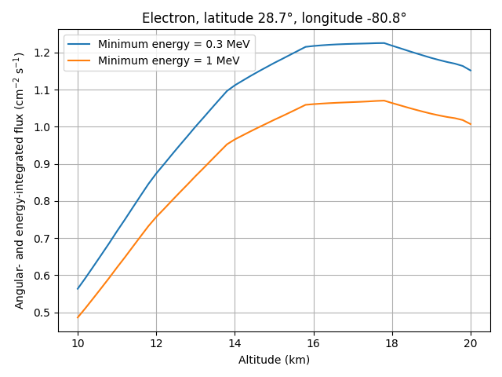

# Atmospheric cosmic-ray flux calculator

This project calculates angular- and energy-integrated atmospheric cosmic-ray fluxes with the PARMA model. The executable retains its historical name, `electron_fluxes`, but supports neutrons, ions, muons, electrons, positrons, and photons.

The supplied Python driver evaluates a grid of thresholds and altitudes, writes a CSV file, and optionally creates a plot.

Example output — integrated electron flux versus altitude at 28.7°N, 80.8°W for 2019-05-27, above energy thresholds of 0.3 and 1 MeV (the default `python3 run_on_grid.py` run computes exactly this figure):



## Requirements

For the model executable:

- GNU Fortran or another compatible Fortran compiler
- `make` on Linux/macOS; on Windows, MinGW-w64 `gfortran` with `mingw32-make` works out of the box

For plotting with `run_on_grid.py`:

```bash
python3 -m pip install -r requirements.txt
```

The Python driver itself uses only the standard library when `--no-plot` is selected. On Windows, substitute `python` for `python3` in the commands below.

## Build

From the project root:

```bash
make
```

On Windows, run `mingw32-make` instead; the `Makefile` detects the platform automatically.

This creates `./electron_fluxes` (`electron_fluxes.exe` on Windows). Build products, including all `.mod` files, are removed by:

```bash
make clean
```

A runtime-checked build is available with `make debug`, a strict-warning build with `make diagnostics`, and the Python driver can be launched with `make run-grid`. Run the regression suite with `make test`, which additionally requires Python 3.

## Single calculation

```text
./electron_fluxes PARTICLE_ID E_MIN ALT_KM LAT_DEG LON_DEG \
  [YEAR [MONTH [DAY [GEOMETRY [ATMOSPHERE [SOLAR_W]]]]]]
```

The first five arguments are required. Optional positional arguments must be supplied in order.

| Argument | Meaning |
|---|---|
| `PARTICLE_ID` | `0` neutron; `1–28` H through Ni; `29` muon+; `30` muon−; `31` electron; `32` positron; `33` photon |
| `E_MIN` | Minimum kinetic energy. Units are MeV/nucleon for ion IDs `1–28`, and MeV for all other particles. It must be greater than zero and below the fixed upper limit of `1e14`. |
| `ALT_KM` | Altitude in kilometres. Valid ranges are −0.5 to 86 km for `standard`, and −0.6 to 99 km for `msis`. |
| `LAT_DEG` | Geographic latitude from −90 to 90 degrees. |
| `LON_DEG` | Geographic longitude from −180 to 180 degrees. |
| `YEAR MONTH DAY` | Date used to look up the bundled solar W index. The default is `2019 5 27`, the latest valid daily value in the supplied table. |
| `GEOMETRY` | Surrounding-environment parameter. The default is `0.15`. See “Geometry” below. |
| `ATMOSPHERE` | `standard`/`us76`/`0` for US Standard Atmosphere 1976, or `msis`/`nrlmsise`/`1` for the bundled NRLMSISE-00 table. |
| `SOLAR_W` | Optional finite, nonnegative W-index override. When present, the date is recorded but not used for solar lookup. |

Example using the bundled daily solar data:

```bash
./electron_fluxes 31 0.3 15 20 -80 2019 5 27 0.15 standard
```

Example for a date outside the bundled tables, using an explicit solar W index:

```bash
./electron_fluxes 31 0.3 15 20 -80 2024 7 29 0.15 standard 50
```

Invalid identifiers, non-finite values, unavailable solar dates, and out-of-range coordinates or altitudes terminate with a nonzero exit status. The program no longer clamps an invalid altitude or returns a plausible value after an out-of-bounds array access.

### Solar-data behavior

The model first uses daily neutron-monitor data when available. Missing daily data fall back to the bundled annual Usoskin/Wolf-number table. A request with no daily or annual value fails rather than silently substituting zero solar activity.

The output identifies the source with a status code:

- `0`: user-provided `SOLAR_W`
- `1`: daily neutron-monitor value
- `2`: annual fallback value
- `3`: daily value marked as a suspected ground-level event, after removal of the table’s encoding offset

### Geometry

The geometry parameter affects the neutron model:

- `0 <= g <= 1`: ground environment; `g` is the water fraction. Use `0.15` when unknown.
- `-10 < g < 0`: pilot/aircraft model; the magnitude encodes aircraft mass in the upstream parameterization.
- `g < -10`: cabin/passenger aircraft model.
- `g >= 10`: idealized no-Earth/semi-infinite-atmosphere mode. Values at or above `100` are also used by PARMA angular routines for black-hole mode.

The ambiguous value `g = -10` and the unsupported interval `1 < g < 10` are rejected.

### Atmosphere selection

`standard` uses the bundled US Standard Atmosphere 1976 depth table. `msis` uses the supplied latitude-dependent NRLMSISE-00 table, which is a static climatological table rather than a live atmosphere calculation.

### Photon annihilation line

For particle ID `33`, the integrated result includes the separate 511 keV annihilation-line contribution whenever `E_MIN <= 0.511 MeV`. The human-readable output reports the continuum, line, and combined total independently.

### Machine-readable output

Every successful run ends with one `RESULT_CSV` record. `run_on_grid.py` parses this record instead of scraping display text. Its fields are:

```text
particle_id, min_energy, max_energy, altitude, latitude, longitude,
year, month, day, solar_w, solar_status, rigidity_gv,
atmospheric_depth_g_cm2, geometry, atmosphere_model,
continuum_flux, line_511_flux, total_flux
```

## Grid calculations

The default command reproduces the electron altitude scan at thresholds of 0.3 and 1 MeV:

```bash
python3 run_on_grid.py
```

This writes `results.local.csv` and the plot `flux_vs_altitude_electron.local.png` (both git-ignored, so a routine run never dirties the working tree). To regenerate the committed reference files shown above, pass `--output results.csv --plot flux_vs_altitude_electron.png` explicitly.

Useful options include:

```bash
python3 run_on_grid.py \
  --particle-id 33 \
  --thresholds 0.3 1.0 \
  --altitude-min 10 --altitude-max 20 --altitude-step 0.2 \
  --latitude 28.7 --longitude -80.8 \
  --year 2019 --month 5 --day 27 \
  --geometry 0.15 --atmosphere standard \
  --output photon-results.csv --plot photon-flux.png
```

Use `--solar-w VALUE` to override the date lookup, `--no-plot` to avoid the Matplotlib dependency, `--show` to open an interactive plot after saving, and `--jobs N` to control how many model runs execute concurrently (default: CPU count; grid points are independent subprocesses). Paths are resolved independently of the caller’s current working directory, subprocesses have a configurable timeout, failed model runs stop the grid calculation, and flux values are written with scientific precision rather than rounded to four decimal places.

## Docker

The Docker build copies the reviewed local source instead of cloning a mutable remote repository:

```bash
docker compose -f run_using_docker/docker-compose.yml build
docker compose -f run_using_docker/docker-compose.yml up --abort-on-container-exit
```

See `run_using_docker/README.md` for command overrides.

## Numerical integration

The energy grid contains 1025 logarithmically spaced points, giving 1024 intervals. Integration is performed in `ln(E)` coordinates with the Jacobian `dE = E dln(E)`, so composite Simpson weights are applied on a genuinely uniform grid and no final interval is omitted. The integration module also contains a corrected unequal-spacing Simpson routine for other callers.

## Tests

```bash
make test
```

The tests cover the integration routines, all particle IDs `0–33`, invalid boundaries, nonzero failure exits, historical annual solar fallback, explicit solar override, atmosphere selection, neutron geometry effects, the 511 keV photon line, and Python path handling.

## Scientific attribution and use terms

The underlying PARMA model is described in:

1. T. Sato, “Analytical model for estimating terrestrial cosmic ray fluxes nearly anytime and anywhere in the world: Extension of PARMA/EXPACS,” *PLOS ONE* 10(12), e0144679 (2015).
2. T. Sato, “Analytical model for estimating the zenith angle dependence of terrestrial cosmic ray fluxes,” *PLOS ONE* 11(8), e0160390 (2016).

The original materials state that non-commercial users should cite these publications and that commercial use requires prior agreement with JAEA. The supplied archive does not contain a standard open-source license grant; consult `LICENSE` and confirm applicable rights with JAEA before redistribution or commercial use.
